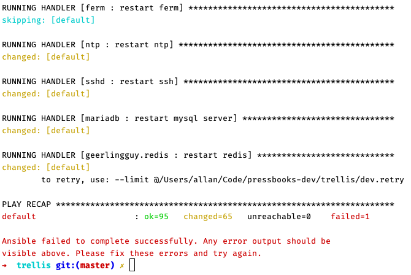
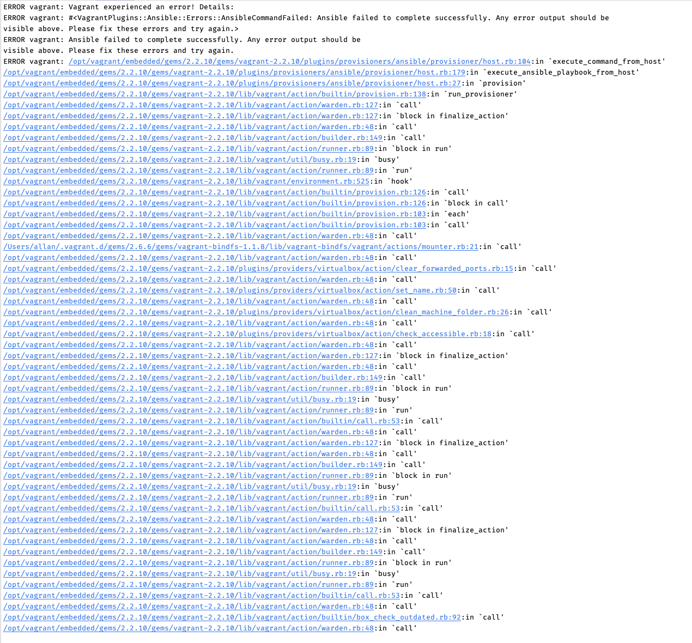

**Requirements:** 
- php 7.3
- phpunit
- composer

Execute the command below for unit tests on the terminal:

```
phpunit
```

Run project by php server
```
php -S localhost:8000 -t public/
``` 

## Question 1
- **GET Method** used to recover information from specific resource by the Request-URI; 
- **HEAD Method** works like GET method, doesn't have response body but meta information, very useful for test and link validation;
- **POST Method** used to send data to be processed considering specific resource, regards the data to be processed, data must be enclosed in the command body;

## Question 2

**Classes related:** 
- App\Model\Astronaut
- App\Service\AstronautService
- Tests\Service\AstronautServiceTest  

##Question 3

Create nasa table command: ./database/question_3_create_table_nasa.sql

**Classes related:**
- App\Provider\ConnectionProvider
- Tests\Provider\ConnectionProviderTest  
- App\Provider\CommandProvider
- Test\Provider\CommandProviderTest
- App\Model\Astronaut
- App\Repository\AstronautRepository
- Tests\Repository\AstronautRepositoryTest  
- App\Service\AstronautService
- Tests\Service\AstronautServiceTest  
- public/index.php
- public/astronaut_form.php
- public/astronaut_list.php

##Question 4

Create nasa table command: ./database/question_4_create_table_person_course_and_relationships.sql

**Classes related**
- App\Provider\ConnectionProvider
- Tests\Provider\ConnectionProviderTest
- App\Provider\CommandProvider
- Test\Provider\CommandProviderTest
- App\Repository\CourseRepository
- Test\Repository\CourseRepositoryTest
- App\Repository\PersonRepository
- Test\Repository\PersonRepositoryTest
- App\PersonCourseRepository
- Test\PersonCourseRepositoryTest
- App\Service\CourseService
- Test\Service\CourseServiceTest
- App\Service\PersonService
- Test\Service\PersonServiceTest
- public/index.php
- public/course_list.php
- public/course_form.php
- public/course_selected.php
- public/person_list.php
- public/person_form.php
- public/person_form_update.php
- public/course_selected.php

##Question 5
**Classes related:**
- App\Helper\StringFormatHelper
- Tests\Helper\StringFormatHelperTest

## Question 6
To configure github repositories to get dependencies using composer:
```
## on composer.json
{ 
...
    "repositories": [
        {
            "type": "vcs"
            "url": "https://github.com/pressbooks/new-private-project"
        }
    ] 
...
}

```

About bugfixes, the better way to explain for me is using git flow. 
Following the flow logic, we have a **develop branch** that represent the last **master branch version**;
all the work will be based in **feature branch** that came from and will be merged on the **develop**; 
when the **develop** is in test mode, and bugs are detected, to fix them we can create **bugfixes branch** 
(by default based on develop branch) and prepare the release that will be merged on master and then create a tag release.
In case to find bugs on the mastere branch will be necessary create **hotfix branch** (based from master branch).  

##Question 7
Unfortunately the after execute vagrant up, was possible access ssh but I didn't have any web access.





##Question 8 
this value (aXA6MTM5LjI4LjIxOC4xODAgdGltZToyMDIwLTEwLTAzIDIxOjE2OjQy = ip:139.28.218.180 time:2020-10-03 21:16:42) is a base64 encoded information.